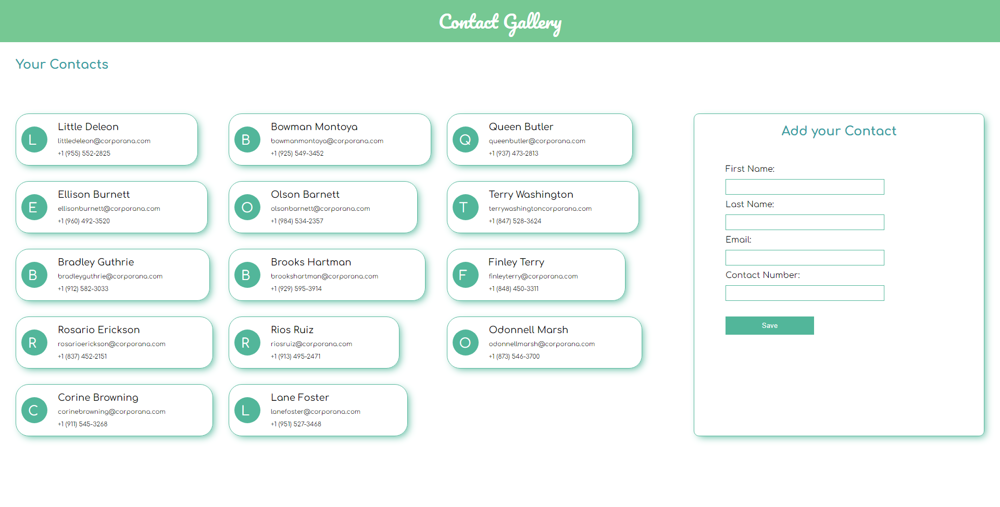

# Contact Gallery - v2

## Summary

This is contact gallary app that allow user to save a contacts using the contact form, user can enter all the information and click on save button to save the contact, the contacts are saved in the local storage in `contacts.json` file.

To run the project use Angular CLI

- `ng new cotact-gallery` and move the `src` folder to your project.
- run `json-server contacts.json` in other cmd window
- This project was generated with [Angular CLI](https://github.com/angular/angular-cli) version 14.2.6.

## Sources

- Fonts - [Comfortaa](https://fonts.google.com/specimen/Comfortaa) , [Pacifico](https://fonts.google.com/specimen/Pacifico)
- Languages - `typescript` , `scss` , `html`

## Development server

Run `ng serve` for a dev server. Navigate to `http://localhost:4200/`. The application will automatically reload if you change any of the source files.

## Generate new componenets

Run `ng generate component component-name` to generate a new component. You can also use `ng generate directive|pipe|service|class|guard|interface|enum|module`.

## Build

Run `ng build` to build the project. The build artifacts will be stored in the `dist/` directory.

## Further help

To get more help on the Angular CLI use `ng help` or go check out the [Angular CLI Overview and Command Reference](https://angular.io/cli) page.

#

## Contributers

